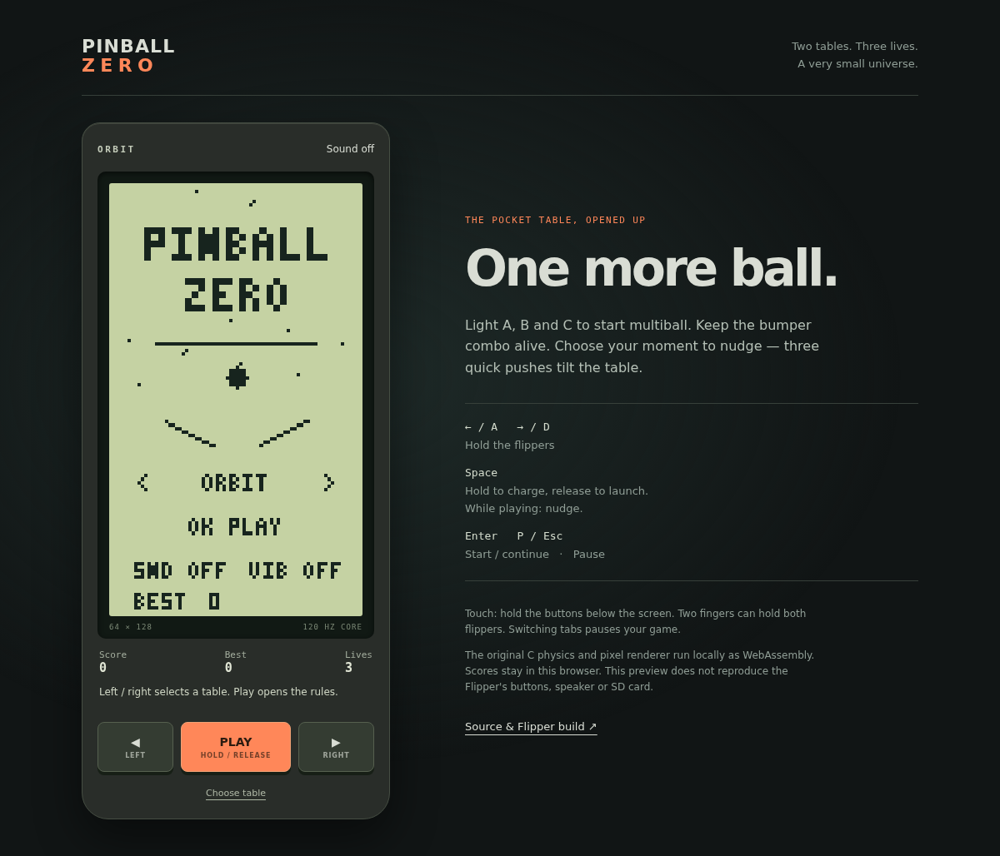
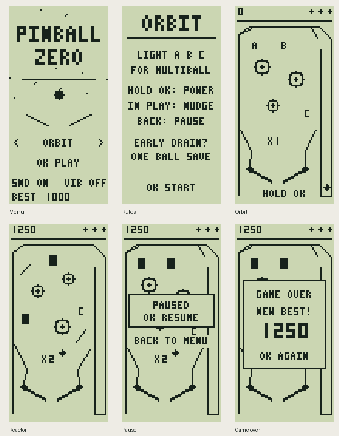

# Pinball Zero

A pocket pinball game for the Flipper Zero's **64 × 128 portrait display**.
Version **0.3.0** rebuilds the game around a portable physics engine and renderer.

## Play in a browser

The new [`web/`](web/) preview runs those same C sources as WebAssembly. It has
touch controls, simultaneous flippers, keyboard input, optional synthetic sound,
pause on focus loss and per-table local best scores. No installation, accounts
or external services are needed by the game:

```bash
python3 -m http.server 8765 --directory web
```

Open `http://localhost:8765`. Choose a table with Left/Right, press Play to read
the rules, then Start. Hold Space to charge and release to launch; use A/D or
the arrow keys for the flippers. Space nudges a moving ball, P/Esc pauses.
Touch users hold the three buttons below the display; two fingers can hold both
flippers. Losing focus cancels a held launcher instead of firing it on resume.

The checked-in WASM needs no runtime imports and is rebuilt from the shared
physics/renderer with a pinned compiler:

```bash
python3 -m pip install ziglang==0.15.2
python3 scripts/build_web.py --check
node --test tests/web.test.mjs
```

Omit `--check` after editing the C sources to regenerate `web/pinball.wasm` and
its source-hash manifest. CI verifies the committed binary, compares native and
WASM trajectories on both tables, and uploads the complete static `web/` folder.
This is a browser preview, not device validation: physical button ergonomics,
Flipper speaker/vibration and SD-card persistence still require hardware.



Browser interaction checks use Playwright:

```bash
npm ci
npx playwright install chromium
npm run test:browser
```

They exercise keyboard launch, two simultaneous touch contacts, cancellation,
pause, sound toggling and denied storage. Desktop and mobile Chromium viewports
have been checked; physical touch devices, Safari and Firefox remain unverified.

## Flipper version



**Status:** compiled with uFBT 0.2.6 and official firmware SDK 1.4.3, target f7,
API 87.1. Host physics tests and native screen renders pass. These images come
from the actual renderer, not a physical Flipper capture. Device playability,
speaker timing and SD-card persistence still need a real-device test.

## What's playable

- Two tables, **Orbit** and **Reactor**, with different rails, bumpers and targets.
- A fixed 120 Hz physics step, moving flipper contact surfaces, collision
  correction and bounded catch-up when rendering stalls.
- Hold-and-release launcher; even a tap reaches the main field.
- Light **A, B and C** to complete a mission, raise the multiplier and start
  two-ball multiball. Losing one ball during multiball keeps the other in play.
- Timed bumper combos, a launch skill shot and one early ball save per life.
- Nudge with a cooling tilt meter. Three quick nudges tilt the table, disabling
  flippers, scoring and the ball save until the next life.
- Three lives, pause/resume, restart, per-table best scores and saved sound /
  vibration preferences. Audio and vibration do not block the simulation.

## Controls

Hold the device sideways to use the portrait screen.

| Screen | Button | Action |
| --- | --- | --- |
| Menu | Left / Right | Select table |
| Menu | Up / Down | Toggle sound / vibration |
| Menu | OK | Show rules, then OK to start |
| Table | Up or Left | Left flipper |
| Table | Down or Right | Right flipper |
| Ready to launch | Hold OK, release | Charge and launch |
| Ball in play | OK | Nudge |
| Table | Back | Pause |
| Paused | OK / Back | Resume / return to menu |
| Game over | OK | Play again |
| Menu | Back | Exit |

Settings and scores are written on leaving a game, game over or app exit.
An interrupted write uses a temporary file; a missing or invalid save falls
back to defaults. Vibration starts disabled.

## Install or build

Copy `dist/flipper_zero_pinball.fap` to the SD card at
`apps/Games/flipper_zero_pinball.fap`, then open **Apps → Games → Pinball**.
Use a build matching your firmware's app API. A firmware mismatch can require
rebuilding with that firmware's SDK.

```bash
python3 -m venv .venv
. .venv/bin/activate
python -m pip install ufbt==0.2.6
ufbt
```

The FAP is created in `dist/`. `ufbt launch` installs and runs it on a connected
Flipper. Pull requests build a downloadable FAP in GitHub Actions.

## Test and inspect

The game core and one-bit renderer compile without the Flipper SDK:

```bash
cc -std=c11 -Wall -Wextra -Werror tests/physics_test.c pinball_physics.c -lm -o /tmp/pinball-test
/tmp/pinball-test
mkdir -p build/preview
cc -std=c11 -Wall -Wextra -Werror tests/render_preview.c pinball_physics.c pinball_render.c -lm -o build/render-preview
build/render-preview build/preview
```

Tests cover launcher regressions, both tables, moving and separating contacts,
fixed-step timing, ball saves, lives, multiball, missions, tilt and 20 simulated
minutes of play. AddressSanitizer and UndefinedBehaviorSanitizer also passed
locally. The preview program emits six PBM screens and 180 gameplay frames.

Before a release, check both tables on hardware: simultaneous flippers, minimum
and full launch, pause while holding a button, multiball, sustained audio,
score persistence after reopening, and returning cleanly to the firmware menu.

## Project boundaries

This repository owns Pinball. The separate `flipper-zero-lab` project contains
the Demoscene, Sequencer, Evolution, Ghost Terminal and Ghost Garden experiments.
Neither project depends on the other to build or run.

## License

[MIT](LICENSE).
